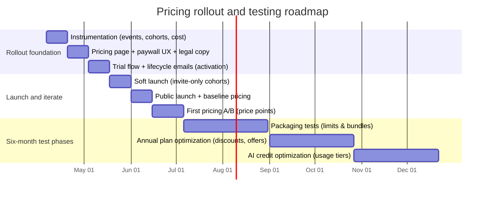

# Pricing Strategy for PensionBridge Pro Subscription

## Executive summary

PensionBridge’s “AI-powered multi-country pension” positioning implies a high-value but trust-sensitive product: users will pay when the app delivers **clear, personalized retirement-income answers**, across **multiple pension schemes / countries**, with **scenario modeling** and **explainable outputs** that reduce the need for (or cost of) human help. This aligns with how public-sector and policy bodies describe the purpose of pension dashboards and tracking systems: consolidating entitlements across sources and helping citizens understand expected retirement income. citeturn38view0turn38view1

The strongest price anchor in adjacent markets is not “pension” software specifically (which is often free via governments or bundled with financial institutions), but **premium retirement / financial planning SaaS** and **personal finance subscriptions**. Direct competitors charge roughly **$80–$289/year** for individual retirement-planning tools (e.g., OnTrajectory, ProjectionLab, Boldin, MaxiFi, WealthTrace), with a **median around Boldin’s $12/month equivalent** in this competitor set. citeturn20view0turn20view2turn35view0turn33view0turn33view1 Adjacent “money clarity” subscriptions are commonly **~$79–$109/year** with short trials (Tiller, Monarch, YNAB). citeturn20view1turn42view0turn23view3 A notable premium outlier is Kubera at **$249/year** (and far higher for a “Black” tier), suggesting that some users pay more for **global/complex situations** and strong positioning around privacy, consolidation, and “expat/global” needs. citeturn39view0turn26view0

Recommended initial pricing architecture for a prototype:

- **Price the core “Pro” for individuals at $12/month (or $120/year)** to match the retirement-planning median anchor and to support an annual discount meaningful enough to move cashflow and retention without underpricing. citeturn35view0turn20view2  
- Add a **Household** tier (couples/families) and an **Advisor** tier (small professional use) early, but keep the plan count to **3–4 total** to reduce confusion—consistent with SaaS pricing/packaging guidance that early-stage teams should avoid excessive plan sprawl. citeturn37view1turn37view0  
- Use a **hybrid model**: base subscription + **usage-based AI credits** for heavy AI/document processing, because AI usage and support costs can scale with consumption; usage-based pricing is widely used when consumption varies (API calls, data processed). citeturn27search7  

Proposed paid tiers (with trial + annual discounts) are detailed below, along with competitor benchmarks, willingness-to-pay ranges, elasticity assumptions, an experimentation plan, and 12‑month revenue projections.

## Product and value proposition

### What PensionBridge appears to be solving

Based on the site’s public positioning (“AI-powered multi-country pension”) and the broader pension-dashboard direction from public policy bodies, the core job-to-be-done is:

- **Consolidate pension entitlements and retirement savings from multiple sources** into a single view. citeturn38view0turn38view1  
- Provide **future retirement income estimates** that are understandable (ideally in real terms / inflation-adjusted) so users can assess whether they are “on track.” citeturn38view0turn38view1  
- Enable **interactive what‑if modeling** (retirement age, contributions, employment characteristics) to drive action. citeturn38view0turn38view1  
- Use AI to help with tasks people already employ AI for in retirement planning: **sense-checking decisions, what‑if scenarios, translating pension jargon, tax awareness/planning, and “coordinating the whole picture.”** citeturn41view0  

This points to a value proposition that is strongest for users with **complexity**:
- multi-country careers, expat moves, multiple schemes, multiple income sources,
- pension “language barrier” (regulatory jargon),
- scenario stress-testing needs.

### Target users and personas

Because PensionBridge is a prototype, the best pricing outcome depends on whether the product is primarily **B2C self‑serve** or **B2B2C / professional**. The pricing architecture below supports both, but you should pick one “default” path for focus.

Primary personas to price for:

- **Global career individual (self‑serve)**: mid/late career, 2+ countries/schemes; wants a consolidated, explainable projection and confidence about timing/choices.  
- **Near‑retirement decision-maker**: needs payout-option comparisons, risk and uncertainty ranges, and a clear checklist of actions.  
- **Household / couple planner**: joint decisions (retirement age coordination, survivor planning, shared spending). OECD notes household-level linking can be important (example: linking to a spouse’s account is referenced as a design pattern). citeturn38view0  
- **Independent advisor / cross-border planner (light professional use)**: wants repeatable reports, client “profiles,” and export/share features; expects higher reliability, auditability, and support.

### Core features to treat as “monetizable” units

Even if not all exist today, these are the feature/value units that map cleanly to packaging:

- **Multi-country / multi-scheme coverage** (countries supported; scheme templates supported).  
- **Scenario slots** (number of saved scenarios; side-by-side comparison).  
- **Depth of modeling** (tax, inflation real-terms, payout options, stochastic analysis).  
- **Export + share** (PDF reports, CSV, “client-ready” summaries).  
- **AI assistant** (Q&A, explanations, “why?” reasoning, translation of jargon) with **credits** to manage variable costs. citeturn41view0turn27search7  
- **Data ingestion** (manual entry vs linking/import; document parsing; number of linked accounts/rows processed). OECD suggests dashboards should link automatically where possible and allow manual linking where not. citeturn38view0  

### Key usage metrics to instrument

Treat metrics as “pricing feedback systems”: you are looking for the smallest set that explains (1) value realization and (2) cost to serve.

Core product and activation:
- **Activation rate**: % of new users who create their first plan and see a retirement-income projection.  
- **Time-to-first-projection (TTFP)**: minutes/hours from signup to first meaningful output.  
- **Scenario depth**: scenarios created per user; scenario comparisons run per month.  
- **Country/scheme complexity**: average number of countries/schemes per user profile.

Engagement and retention:
- **WAU/MAU**, **DAU/MAU**, cohort retention by week/month.  
- **“Decision window” engagement**: e.g., users within 24 months of target retirement date.  
- **Export/share actions**: PDF exports, links shared, advisor-share events.

AI and compute usage (also ties to cost controls):
- **AI messages per user per month**, plus **token usage** (or equivalent compute) and **AI cost per active user**.  
- **Document uploads parsed**, **data rows processed**, **import failures**, and **link success rates** (if linking exists).

Monetization:
- **Trial-to-paid conversion**, **paid-to-retained conversion (Month 2)**, **ARPA**, **net revenue retention** (if expansion exists), and churn by plan.  
- **Elasticity proxies**: conversion change vs price test buckets.

### Cost structure

Current PensionBridge cost structure is **unspecified** (hosting, databases, model APIs, data licensing, storage, and compliance costs were not provided).

Given the AI + multi‑country nature, the cost lines that typically become pricing-relevant (because they scale with usage) are:
- AI inference (tokens / calls),  
- account import/link providers (if used),  
- storage + analytics,  
- customer support (especially if positioned as a high-trust retirement tool).

This is why the recommendation includes a modest **usage-based AI credit system** atop subscriptions. citeturn27search7  

## Market landscape and competitors

Two important competitive realities shape PensionBridge pricing:

- **Free anchors exist**: some dashboards and retirement tools are free (or employer/government-provided), which increases price sensitivity unless PensionBridge is meaningfully better for complex, cross-border scenarios. The EU explicitly frames pension tracking systems/dashboards as citizen tools providing future income overviews. citeturn38view1turn38view0  
- **Premium planning tools already charge “subscription-level” amounts** for modeling, Monte Carlo, tax-aware planning, and scenario management—this is the closest direct benchmark for a “Pro” subscription. citeturn35view0turn20view2turn33view1turn33view0turn20view0  

### Competitor comparison table

Pricing captured from official pricing pages/help centers where available (noting that some competitors show promotional prices).

| Competitor | Positioning | Tiers & prices (monthly / annual) | Features by tier (high level) | Free tier / trial |
|---|---|---|---|---|
| entity["company","Boldin","retirement planning software"] | Retirement planning software + scenarios | Basic: Free; PlannerPlus: $12/mo, $144/yr; Advisors: $2,800 flat fee | Basic: build plan, answers, what‑ifs; PlannerPlus adds more inputs, account linking, Roth/tax projections, multiple scenarios + compare, charts, Monte Carlo, budgeting, coach + classes | Free Basic + 14‑day trial for PlannerPlus citeturn35view0 |
| entity["company","ProjectionLab","financial planning software"] | DIY financial + retirement planning | Basic: $0/yr; Premium: $129/yr; Lifetime: $1,199 one-time; Pro: $549/yr | Premium adds tax estimation/analytics, what‑ifs, reports, international planning; Pro adds client management, 10 client seats + extra clients priced per month | Free tier; Pro has a free trial CTA citeturn20view2 |
| entity["company","WealthTrace","retirement planning software"] | Retirement planning software (individuals + advisors) | Individuals Standard: $229/yr; Individuals Deluxe: $289/yr; Advisor: $1,049/yr or $315/quarter | Standard includes Monte Carlo, scenarios, account linking; Deluxe adds historical data/performance history, Roth + asset allocation scenarios; Advisor adds client portal, reports, fact finder, Yodlee linking | Free trial, no credit card required citeturn33view1 |
| entity["company","MaxiFi","personal financial planning software"] | Economics-based planning; Social Security optimization | Standard: $109/yr; Premium: $149/yr; Premium Plus: $359/yr | Standard includes lifetime plan, scenarios, “unlimited reports,” retirement withdrawal + Social Security timing; Premium adds Monte Carlo, Roth optimizer, contingency planning; Premium Plus adds expert help (“Flight Check”) | No free tier mentioned on pricing page | citeturn33view0 |
| entity["company","OnTrajectory","financial planning software"] | Financial planning software with scenarios | Basic: Free; Unlimited: $9/mo or $80/yr | Basic includes plan visualization + 1 scenario; Unlimited adds unlimited scenarios, Monte Carlo + historical analysis, customization + taxes, account withdrawal optimization | Free plan available citeturn20view0 |
| entity["company","YNAB","budgeting app"] | Subscription budgeting + education | Monthly: $14.99/mo; Annual: $109/yr | Single feature set; budgeting method + syncing; notable limitation: can select a currency but cannot use multiple currencies in one budget | 34‑day free trial, no credit card required citeturn23view3turn22view0 |
| entity["company","Monarch Money","personal finance app"] | “Home base for money clarity” (tracking + goals) | Annual shown: $99.99/yr (monthly option exists on page but price not visible in captured text) | One price includes tracking (unlimited accounts), integrations, budgeting/planning, and unlimited collaborators | “First week is on us” (trial implied by page) citeturn42view0 |
| entity["company","Quicken","personal finance software"] | Personal finance + budgeting + projections | Simplifi: discounted $2.99/mo, regular $5.99/mo billed annually; Business & Personal: discounted $3.99/mo, regular $7.99/mo billed annually | Simplifi includes spend/saving visibility, reports/alerts, investment portfolio insights, projected cashflow; 30‑day money‑back guarantee noted | 30‑day money‑back guarantee (trial-like) citeturn34view1 |
| entity["company","Tiller","spreadsheet finance app"] | Sheets/Excel-based finance automation | $79/yr | One tier; spreadsheet automation + templates (pricing page emphasizes no ads, cancel anytime) | 30‑day free trial citeturn20view1 |
| entity["company","Kubera","net worth tracker"] | HNI/expat net worth tracking + AI | Essentials: $249/yr; Black: $2,499/yr | Black adds nested portfolios, granular access control, concierge onboarding, VIP support; site positions global tracking + expat use cases | 14‑day trial citeturn39view0turn26view0 |
| entity["company","Empower","financial services company"] | Free financial dashboard (Personal Capital → Empower) | Dashboard: Free (no paid dashboard tier shown) | Free dashboard positioning (advisory fees are separate) | Free access emphasized | citeturn22view3 |

## Willingness-to-pay and price elasticity

### What comparable products imply about willingness-to-pay

Across the **direct retirement-planning** set, individual subscriptions cluster around:
- **~$80–$149/year** for “serious DIY planning” (OnTrajectory, ProjectionLab, MaxiFi),  
- **~$144/year** for a popular “Pro planning” tier (Boldin),  
- **~$229–$289/year** for higher-priced, modeling-heavy tools (WealthTrace). citeturn20view0turn20view2turn33view0turn35view0turn33view1  

Adjacent apps show a strong willingness-to-pay for “money clarity” even without pension specialization:
- **$79/year** for spreadsheet automation (Tiller),  
- **$99.99/year** for a unified personal finance app (Monarch),  
- **$109/year** or **$14.99/month** for a budgeting methodology product (YNAB). citeturn20view1turn42view0turn23view3  

This competitive landscape supports a **PensionBridge Pro price band of roughly $9–$15/month** (or **$90–$150/year**) for an individual “serious planning” tier—*if* the product convincingly solves cross‑border pension complexity and provides a high-confidence projection experience.

### Value-based ceiling from “human alternative” pricing

If PensionBridge substitutes even a small fraction of paid advice cost, the perceived value ceiling is high. Consumer-oriented sources commonly cite:
- financial advisor AUM fees “about 1%” (with robo-advisors lower), citeturn29search4turn29search1  
- one-time plans and retainers in the “hundreds to thousands” annually. citeturn29search4  

PensionBridge should not price against the full advice market (trust/regulation differ), but this supports a message that **$10–$20/month is “small” relative to advice**, assuming PensionBridge is clear that it is educational/planning support, not regulated advice.

### Elasticity estimate and assumptions

Because (a) **free anchors** exist and (b) the market has many “good enough” substitutes (spreadsheets, free dashboards, single-country tools), **new-customer demand is likely price elastic**. The most defensible approach is to treat elasticity as an **empirical unknown** and measure it.

A practical starting prior for early-stage B2C/PLG pricing tests:

- **New buyer elasticity (trial → paid)**: **–1.2 to –2.0** (a 10% price increase could reduce conversion ~12–20%).  
- **Activated/retained user elasticity (renewal)**: **–0.6 to –1.0** (more inelastic; value and switching costs dominate).

These are **assumptions** to be validated; they are consistent with the pricing research mindset described by entity["organization","Business of Software","saas conference"] content featuring Patrick Campbell’s discussion of building elasticity curves and estimating volume loss when prices increase. citeturn32view0  

Pricing and packaging’s outsize impact is echoed in SaaS benchmarks: entity["company","OpenView Partners","vc firm"] reports a median **+14% impact on net dollar retention** from changing pricing among expansion-stage companies (B2B context but directionally relevant for “pricing is a lever”). citeturn32view1

## Recommended pricing models and plans

### Pricing model recommendation

A prototype should optimize for **learning velocity** and **confident purchase decisions**, not theoretical maximum revenue. Recommended architecture:

- **Freemium + tiered subscription** for the core product:
  - Freemium to compete with free anchors and let users reach a “first projection” moment without friction.
  - Tiering to map to value: complexity (countries/schemes), saved scenarios, exports, and planning depth.
- **Hybrid subscription + usage for AI-heavy features**:
  - Base subscription covers product access and predictable costs.
  - AI/document features use monthly credits so heavy users pay more, aligned with usage-based pricing logic for variable consumption. citeturn27search7  
- Keep it to **3–4 plans total** at launch to avoid buyer confusion; SaaS pricing benchmarks emphasize that too many plans early can confuse buyers and that many businesses under ~$10M ARR typically keep plan counts modest. citeturn37view1turn37view0  

### Proposed subscription plans

Assuming USD pricing initially (localize later), with annual discounts designed to shift buyers to annual billing for improved cashflow and reduced churn.

| Plan | Monthly | Annual | Target persona | Included features | Limits (example) |
|---|---:|---:|---|---|---|
| Explorer | $0 | $0 | Curious users; single-country/simple case | Manual data entry; 1 country/scheme set; 1 scenario; basic charts; limited AI “explain” prompts | 1 profile; 1 scenario; 1 country; AI: 10 messages/month; no exports |
| Pro | $12 | $120 | Global career individual; serious DIY planners | Multi-country modeling; inflation-aware outputs; scenario compare; exports; “AI pension translator” and what‑if assistant | 1 profile; up to 3 countries; 10 saved scenarios; AI: 200 messages/month; 10 PDF exports/month |
| Household Pro | $18 | $180 | Couples/households | Everything in Pro + household linking, survivor-focused outputs, shared goals and spending assumptions | 2 adults + 1 dependent profile; up to 5 countries; 20 scenarios; AI: 350 messages/month; 30 PDF exports/month; 5 collaborators |
| Advisor Pro | $59/seat | $590/seat | Independent advisors / mobility consultants | Client workspace; audit trail + assumptions log; client-ready reports; share links; higher support SLA; optional add-on client packs | 1 seat; 15 client profiles included; AI: 1,000 messages/month; additional client profiles billed per pack |

Notes:
- The “countries supported” limit is a pricing lever aligned with PensionBridge’s unique value proposition (multi-country). OECD highlights that dashboards should consolidate across sources and support planning; PensionBridge can charge for cross-border depth beyond standard dashboards. citeturn38view0turn38view1  
- You can later add an enterprise plan (employers) once product reliability and compliance posture are validated.

### Suggested trial and discount mechanics

Borrowing from market norms:
- **14‑day Pro trial** (fits the retirement-planning category; Boldin uses 14 days). citeturn35view0  
- For Household Pro, consider **7‑day trial** (shorter, but adequate for verifying collaboration).  
- Offer a **launch cohort discount** (e.g., first-year annual at $99 for Pro) to seed early adoption—explicitly time-boxed to avoid permanent price anchoring.

Onboarding offers should reduce churn risk by driving users to the “first projection” and “first scenario comparison” moments quickly (see experimentation section).

## Experimentation and rollout timeline

### Pricing A/B tests and success metrics

Core metrics to track (minimum viable dashboard):
- **MRR**, **ARPA/ARPU**, **paid conversion** (trial→paid), **CAC**, **LTV**, **gross margin**, and **churn** (logo + revenue).  
- Funnel diagnostics: visitor→signup, signup→activated (first projection), activated→trial started, trial→paid, Month‑2 retention.  
- AI unit economics: **AI cost per active**, cost per “insight session,” and % of users exhausting included AI credits.

Suggested experiments (high signal, low complexity):
- **Price point test (Pro)**: $9 vs $12 vs $15 monthly (and corresponding annual). Measure conversion lift and net revenue impact using an elasticity model.  
- **Packaging test**: limit by (A) countries or (B) saved scenarios. Measure which creates clearer upgrade behavior and less support burden.  
- **Trial test**: 7 vs 14 vs 30 days; evaluate conversion *and* Month‑2 retention (long trials can increase conversion but may lower urgency).  
- **AI credits test**: include “small credits” vs “unlimited AI” (with soft fair-use). Measure AI cost blow-ups and perceived value.

### Mermaid rollout timeline

## Revenue projections

These projections are **illustrative** and intended to stress-test pricing, not to forecast with precision. They output **MRR-equivalent recognized revenue** (annual prepay cashflow is not modeled). Assumptions are explicit below.

### Assumptions used

B2C funnel (Pro + Household):
- Monthly qualified visitors start at **1,500 / 3,000 / 6,000** (Conservative/Likely/Optimistic) with monthly growth **5% / 10% / 15%**.
- Visitor → trial signup: **5% / 7% / 9%**.
- Trial → paid conversion: **4% / 6% / 8%**.
- Plan mix of *new* paid subscribers: **75% Pro / 25% Household Pro**.
- Monthly churn: Pro **5% / 4% / 3%**; Household Pro **(Pro churn –1pp)** with a 2% floor.

Advisor Pro (B2B-ish motion):
- Sales-qualified leads per month start at **10 / 20 / 40** with growth **5% / 10% / 15%**.
- Close rate: **15% / 20% / 25%**.
- Monthly churn: **2.0% / 1.5% / 1.0%**.

### Pro plan revenue projection (MRR)

|   Month | Conservative   | Likely   | Optimistic   |
|--------:|:---------------|:---------|:-------------|
|       1 | $27            | $113     | $389         |
|       2 | $54            | $234     | $824         |
|       3 | $81            | $361     | $1,314       |
|       4 | $108           | $498     | $1,866       |
|       5 | $136           | $644     | $2,490       |
|       6 | $163           | $801     | $3,198       |
|       7 | $191           | $970     | $4,000       |
|       8 | $219           | $1,154   | $4,910       |
|       9 | $247           | $1,354   | $5,942       |
|      10 | $276           | $1,573   | $7,113       |
|      11 | $308           | $1,802   | $8,440       |
|      12 | $339           | $2,046   | $10,058      |

### Household Pro plan revenue projection (MRR)

|   Month | Conservative   | Likely   | Optimistic   |
|--------:|:---------------|:---------|:-------------|
|       1 | $14            | $57      | $194         |
|       2 | $27            | $117     | $414         |
|       3 | $41            | $182     | $663         |
|       4 | $55            | $252     | $945         |
|       5 | $69            | $328     | $1,266       |
|       6 | $84            | $410     | $1,633       |
|       7 | $99            | $497     | $2,051       |
|       8 | $114           | $592     | $2,527       |
|       9 | $130           | $692     | $3,070       |
|      10 | $147           | $801     | $3,689       |
|      11 | $161           | $925     | $4,400       |
|      12 | $177           | $1,066   | $5,221       |

### Advisor Pro plan revenue projection (MRR)

|   Month | Conservative   | Likely   | Optimistic   |
|--------:|:---------------|:---------|:-------------|
|       1 | $88            | $236     | $590         |
|       2 | $180           | $492     | $1,263       |
|       3 | $274           | $770     | $2,030       |
|       4 | $371           | $1,073   | $2,907       |
|       5 | $471           | $1,402   | $3,910       |
|       6 | $574           | $1,761   | $5,057       |
|       7 | $681           | $2,152   | $6,368       |
|       8 | $792           | $2,581   | $7,878       |
|       9 | $907           | $3,048   | $9,604       |
|      10 | $1,026         | $3,558   | $11,583      |
|      11 | $1,150         | $4,117   | $13,854      |
|      12 | $1,278         | $4,729   | $16,461      |

Interpretation:
- In the likely scenario, **B2C MRR** lands around **$3.1k** combined (Pro + Household) by Month 12, while **Advisor MRR** lands around **$4.7k**—but this depends heavily on whether a real advisor acquisition channel exists.
- These tables should be used to set **instrumentation requirements** (what you must measure) and to size “how much testing” is needed (sample sizes), not as a commitment forecast.

## Assumptions and unspecified inputs

Unspecified inputs (should be provided or measured before locking pricing):
- Current PensionBridge feature set, onboarding steps, and which functions are truly working end-to-end (linking, uploads, multi-country coverage).
- Data sources (official pension data integrations vs manual entry) and any licensing costs.
- AI stack costs (token pricing; model choice; caching strategy) and expected AI usage distribution.
- Target geography/currency strategy (USD vs EUR vs localized) and tax/VAT handling.
- Intended regulatory posture and disclaimers (education vs advice; advisor workflows).

Key assumptions made in this report:
- PensionBridge fits the “pension dashboard + scenario planning + AI explanation” product category, consistent with how dashboards are described by the entity["organization","OECD","intergovernmental org"] and entity["organization","European Commission","eu executive body"]. citeturn38view0turn38view1  
- Users are increasingly comfortable using AI for retirement planning tasks like what‑if modeling and translation of jargon, supporting the viability of an AI assistant as a paid feature. citeturn41view0  
- You will follow modern SaaS best practices: limited plan count, iterative pricing updates, and value-based packaging emphasized in pricing benchmarks from entity["company","SBI Growth","go-to-market consultancy"] / entity["company","Price Intelligently","pricing consultancy"] and SaaS benchmarks from OpenView. citeturn37view0turn37view1turn32view1turn40view0